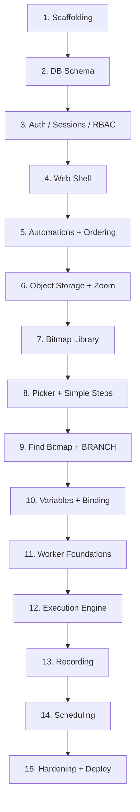

# Implementation Plan — GUI Automation Task Server

Companion document: [GUI Automation Task Server — Technical Specification](https://claude.ai/artifact/DoHTVAtqQLMyjSENZW7DVx). This plan turns that spec into 15 sequential, evenly-scoped implementation steps, starting from an empty directory. Every step ends with the application in a compiling, runnable, manually-verifiable state — none of them are "write code that only makes sense once a later step exists." A commit (or PR) per step is a reasonable way to track progress against this plan. The local dev stack (Postgres + MinIO via `docker-compose`) is stood up in Step 1 and used for real, manual verification at the end of every subsequent step — nothing here is meant to be checked against mocks.

## Table of Contents
1. [Project Scaffolding & Development Environment](#step-1)
2. [Full Database Schema (Migrations)](#step-2)
3. [Authentication, Sessions, CSRF & RBAC](#step-3)
4. [Web Application Shell](#step-4)
5. [Automations CRUD & Step-Ordering Skeleton](#step-5)
6. [Object Storage & the Screenshot Zoom Component](#step-6)
7. [Bitmap Library](#step-7)
8. [Coordinate Picker + Point-Based Step Types](#step-8)
9. [Complex Step Types — Find Bitmap & BRANCH](#step-9)
10. [Variables, Parameters & Dynamic Value Binding](#step-10)
11. [Worker Registration, Management & Worker API Foundations](#step-11)
12. [Task Execution Engine & Dispatch](#step-12)
13. [Recording — Capture, Review & Conversion](#step-13)
14. [Scheduling Engine](#step-14)
15. [Hardening, Observability & Deployment](#step-15)
- [Completion Checklist](#completion-checklist)

## Step Dependency Flow

---

## Step 1 — Project Scaffolding & Development Environment

**Goal:** Get from an empty directory to a `cargo run`-able server backed by a real local Postgres + object-storage stack, before any application logic exists.

**What to implement:**
- Initialize the Cargo binary crate and pin the stack decided in the spec: `axum`, `tokio` (full), `sqlx` (`postgres`, `runtime-tokio-rustls`, `macros`), `askama`, `argon2`, `aws-sdk-s3`, `croner`, `tracing` + `tracing-subscriber`, `serde`/`serde_json`, `uuid`, `dotenvy`.
- `docker-compose.yml` for local dev: `postgres:16` and `minio/minio` (S3-compatible), with a one-shot bucket-creation step.
- `config.rs`: env-var driven config (DB URL, S3 endpoint/credentials/bucket, session cookie signing key, bind address).
- `sqlx-cli` wired up: `migrations/` directory, documented `sqlx migrate run`, empty first migration.
- `tracing_subscriber` initialization (pretty in dev, JSON in prod).
- Minimal `main.rs`: builds the axum `Router`, a `PgPoolOptions` pool, an S3 client, and serves `GET /healthz` (200 OK, with a live DB round-trip).
- `README.md` documenting the three commands to get running.

**Deliverable:** From a clean checkout, `docker-compose up -d && sqlx migrate run && cargo run` starts a server whose `/healthz` returns `200 OK` and proves a live database connection.

## Step 2 — Full Database Schema (Migrations)

**Goal:** Every table the application will ever need exists, with its constraints and indexes, before any Rust code queries it.

**What to implement:**
- Migrations in dependency order: (1) `users` / `sessions` / `audit_log`; (2) `automations`; (3) `automation_variables` / `automation_parameters`; (4) `bitmaps`; (5) `automation_steps`; (6) the five step-detail tables (`step_mouse_clicks`, `step_key_presses`, `step_find_pixel_rgb`, `step_find_bitmap`, `step_branches`) plus `step_screenshots`; (7) `task_worker_pcs` / `worker_groups` / `worker_group_members`; (8) `schedules`; (9) `task_runs` / `task_run_steps` / `task_run_variable_values`; (10) `recording_sessions` / `recording_events`.
- All CHECK constraints (discriminated-union pattern on `step_branches` and the literal-vs-variable pairs) and indexes (`idx_steps_automation_position`, `idx_schedules_due`, `idx_task_runs_queued`) land with the tables that need them.
- A `seed` binary creating the first admin user from env vars, so Step 3 has something to log in as.
- A compile-time-checked `sqlx::query!` smoke test confirming the macros resolve correctly against the live schema.

**Deliverable:** `sqlx migrate run` against a clean database produces the complete data model from the spec; the seed script produces a working admin login.

## Step 3 — Authentication, Sessions, CSRF & RBAC

**Goal:** No page is reachable without a valid session, and no mutation is possible without the right role and a valid CSRF token.

**What to implement:**
- `POST /login` (argon2id verify) / `POST /logout`; on success, insert a `sessions` row and set a signed, HttpOnly, `SameSite=Lax` cookie holding only the session ID.
- An `AuthUser` extractor loading the session from the cookie, redirecting to `/login` on missing/expired sessions, and exposing `role` to handlers.
- A role-check layer/extractor implementing the spec's viewer/editor/admin matrix, usable per-route.
- CSRF: a per-session token, rendered via a shared askama macro into every form, checked by a `tower` layer ahead of every POST handler.
- Login rate limiting by client IP (`ConnectInfo`) + username, with eviction; a generic failure message that doesn't leak whether the username exists.
- `GET`/`POST /account/password` self-service change.

**Deliverable:** Unauthenticated requests redirect to `/login`; a viewer hitting an editor-only POST gets 403; a login form replayed without its CSRF token is rejected; repeated failed logins are throttled.

## Step 4 — Web Application Shell

**Goal:** A navigable, role-aware shell exists — the scaffolding every later page renders into — even though most links are still stubs.

**What to implement:**
- A base askama `layout.html` with the spec's top nav (Dashboard · Automations · Schedules · Runs · Workers · Users [admin-only] · Account), rendered conditionally by role.
- `GET /` Dashboard: the four summary tiles plus Recent Runs / Workers tables, querying the real (currently empty) tables rather than mock data.
- 404 / 500 pages using the same layout.
- A static-asset route (or `rust-embed`) serving hand-written CSS — no bundler, consistent with the zero-JS constraint.

**Deliverable:** Logging in lands on a real Dashboard inside real navigation; every nav link resolves (to a "coming soon" stub where not yet built) without panicking.

## Step 5 — Automations CRUD & Step-Ordering Skeleton

**Goal:** Automations can be created, listed, renamed, and archived, and their steps inserted/reordered/deleted — proven against the simplest step type before the rest exist.

**What to implement:**
- `automations` CRUD: list (with status filter), create, rename/status update, delete/archive with confirmation.
- The automation editor page shell: renders `automation_steps` ordered by `position`, one card per step.
- `key_press` implemented end-to-end (one text field) purely as the vehicle for proving ordering before harder types exist.
- The sparse-`position` insert algorithm (midpoint between neighbors, append past the last), `move-up` / `move-down`, delete, and the compaction path for when gaps get too small.

**Deliverable:** An automation with several `key_press` steps can have a step inserted mid-sequence, moved, and deleted through the UI, with `position` behaving correctly under repeated inserts.

## Step 6 — Object Storage & the Screenshot Zoom Component

**Goal:** Prove the hardest UI requirement in isolation — three CSS-only zoom levels of one stored image, with a positioned marker — before anything else depends on it.

**What to implement:**
- The S3/MinIO wrapper: presigned GET (viewing), presigned PUT (worker uploads), presigned POST policy (browser uploads), per the spec's zero-JS design principles.
- The reusable askama partial implementing the three-panel magnifier (`shot--normal` / `shot--zoom400` / `shot--grid`): server-computed background-position/size per panel, `image-rendering: pixelated`, the CSS-triangle marker positioned per panel's own scale.
- `GET /media/screenshots/{id}` and `GET /media/bitmaps/{id}`: 302 to a freshly minted presigned GET URL — no byte-proxying through axum.
- A throwaway internal demo route rendering the component against a manually uploaded test image, to check the zoom/pan math visually before Steps 7–8 build on it.

**Deliverable:** Given any stored image and an (x, y), all three panels render correctly — pixel-sharp at the grid level, marker aligned in each — verified via the demo route.

## Step 7 — Bitmap Library

**Goal:** Reference bitmaps — needed by Find Bitmap and BRANCH in Step 9 — can be uploaded or cropped straight from a screenshot.

**What to implement:**
- `bitmaps` CRUD: list with thumbnails (via Step 6's component), upload form posting directly to object storage through the presigned-POST policy, delete.
- The two-click region picker (`<input type="image">`, top-left corner then bottom-right corner, the fine pick using a Step 6 grid panel), with a confirm/re-pick crop preview before saving.

**Deliverable:** A user can either upload an image file or select a rectangular region on an existing step's screenshot and save it as a named, reusable bitmap.

## Step 8 — Coordinate Picker + Point-Based Step Types

**Goal:** Extend step authoring from Step 5's `key_press`-only proof to the three point-based primitives, introducing the two-stage coordinate picker.

**What to implement:**
- The two-stage `<input type="image">` picker: coarse click on the fit-to-width screenshot → server computes an approximate native pixel from the display scale → fine click on a Step 6 grid panel → exact coordinate, landing in editable numeric X/Y fields (which remain directly typeable as a fallback).
- `mouse_click` (x/y via picker, button, click type) and `find_pixel_rgb` (x/y via picker; output-variable field stubbed until Step 10) create/edit forms.
- The `+ New Step` type-picker page (five buttons; `find_bitmap`/`branch` stubbed for now).
- Plain-language step descriptions for these three types, per the spec's template table.

**Deliverable:** A user can click on a real screenshot — coarse, then fine — to place an exact mouse-click or pixel-check coordinate, and the resulting step card shows the correct plain-language line.

## Step 9 — Complex Step Types: Find Bitmap & BRANCH

**Goal:** Implement the two step types with the most moving parts: region search against a reusable bitmap, and — for BRANCH — a discriminated pixel/bitmap condition plus two goto targets.

**What to implement:**
- `find_bitmap` form: pick an existing bitmap (Step 7's library) or select a fresh region, optional search-region box (default: full screen), match threshold.
- `branch` form: a condition-type toggle (pixel vs. bitmap) revealing only the relevant sub-fields, and two "go to step" selectors populated from the automation's current steps (shown by computed "Step N" + plain-language preview, stored as FKs to the stable step ID).
- Plain-language descriptions for both, including BRANCH's "if X → Step A, else → Step B" phrasing.

**Deliverable:** A BRANCH step can be authored end-to-end and its card renders exactly like the spec's worked example: "if pixel at (…) ≈ RGB(…) → go to Step 12, else → go to Step 10."

## Step 10 — Variables, Parameters & Dynamic Value Binding

**Goal:** Make configuration dynamic — an earlier step's captured output can drive a later step's input, and tunable constants don't require editing every step that uses them.

**What to implement:**
- `automation_variables` and `automation_parameters` CRUD (name/type/description; parameters add a default value).
- The literal-vs-reference toggle on the relevant fields across the Step 8/9 forms, enforcing the "exactly one of literal or reference" constraint at the form level with a clear inline error if violated.
- Wire the `find_pixel_rgb` / `find_bitmap` output-variable fields (stubbed in Step 8) to real `automation_variables` selection.

**Deliverable:** A `find_bitmap` step's found-location output can be selected as a later `mouse_click`'s x/y source, and that step's card visibly reads "(from «found_login»)" instead of a hardcoded coordinate.

## Step 11 — Worker Registration, Management & Worker API Foundations

**Goal:** A worker PC can be registered and successfully authenticate against the server, before there's any real work for it to do.

**What to implement:**
- `task_worker_pcs` / `worker_groups` / `worker_group_members` admin CRUD (list, register-new, detail, deactivate, rotate-key).
- Registration-token generation and `POST /api/v1/workers/register` (token → permanent API key, SHA-256-hashed at rest, token cleared after use).
- A worker-auth extractor: `Authorization: Bearer` → hash lookup → 401 on failure.
- `POST /api/v1/workers/heartbeat` and `GET /api/v1/workers/next-assignment` (long-poll ~25s), initially always resolving `{"type":"none"}`.

**Deliverable:** A test client can register using a token issued from the Workers page, then heartbeat and long-poll successfully with the resulting key; the Workers page reflects it as `online`.

## Step 12 — Task Execution Engine & Dispatch

**Goal:** `next-assignment` starts returning real work, a worker can execute and report it, and the operator can watch it happen.

**What to implement:**
- `POST /automations/{id}/run-now` → inserts a `queued` `task_runs` row.
- The dispatch claim inside `next-assignment`: `SELECT … FOR UPDATE SKIP LOCKED` for the oldest assignable queued run, claim it (`running`, `worker_id`, `started_at`), return the full automation JSON per the spec's example payload.
- Remaining worker endpoints: `GET /task-runs/{id}` (resume), `POST .../step-result`, `GET .../screenshot-upload-url` + `POST .../screenshots/{key}/commit`, `POST .../complete`.
- The stale/lost-run sweep alongside dispatch: `running` runs whose worker's heartbeat has gone quiet move to `status = 'lost'`.
- `GET /runs` (filterable), `GET /runs/{id}` (step-by-step log against *captured* values, using the Step 6 component), `POST /runs/{id}/cancel`.

**Deliverable:** Run Now against a real automation and an online (simulated) worker produces a complete Run History entry with per-step captured values and screenshots; killing the worker mid-run correctly surfaces as `lost` rather than hanging indefinitely.

## Step 13 — Recording: Capture, Review & Conversion

**Goal:** A real action sequence performed on a worker PC becomes a fully editable automation, without hand-authoring every step.

**What to implement:**
- `recording_sessions` / `recording_events` application logic; extend `next-assignment` to also resolve `{"type":"start_recording", ...}`.
- Worker endpoints: `POST /recordings/{id}/events` (batched), `GET .../screenshot-upload-url`, `POST /recordings/{id}/stop`.
- Web UI: start (worker picker), live status (`meta refresh` + Stop button), review (event cards via the Step 6 component, per-event Exclude checkbox), convert (bulk-creates `automations` + `automation_steps` + `step_screenshots` from the non-excluded events) and discard.

**Deliverable:** A simulated recording's captured clicks/keys become a new draft automation, fully editable through every page built in Steps 5–10.

## Step 14 — Scheduling Engine

**Goal:** Automations run themselves on a cron-like schedule, with no human clicking Run Now.

**What to implement:**
- `schedules` CRUD: list, create/edit (cron-expression field with an inline format hint, `croner`-backed server-side validation and an inline error on malformed input), enable/disable toggle.
- The scheduling tick (`tokio::time::interval`, ~30s): `SELECT … FOR UPDATE SKIP LOCKED` on due enabled schedules, insert a `task_runs` row per due schedule, recompute `next_run_at` via `croner`.
- Wire `worker_group_id` targeting into Step 12's dispatch claim, so a schedule-originated run only offers itself to workers in the right group.

**Deliverable:** An enabled schedule with a short test cron expression produces new runs on its own, on an available worker in the correct group, over several cycles with no manual trigger.

## Step 15 — Hardening, Observability & Deployment

**Goal:** Take the feature-complete application from "works on my machine" to the spec's security/performance posture and an actually deployable artifact.

**What to implement:**
- `audit_log` writes on every create/update/delete handler across the whole app, not just auth.
- An `EXPLAIN` pass confirming every Step 2 index is actually used by its intended query (dispatch claim, schedule-due lookup, step-position lookup).
- `tracing` spans around request handling, DB calls, and S3 calls; confirm structured JSON logging in a prod-like run.
- A multi-stage `Dockerfile` and a production `docker-compose.yml` (app + Postgres + object storage, migrations as a startup step).
- A manual QA pass walking every page and button in the spec's route map end-to-end, plus `sqlx::test`-backed integration tests around the highest-risk logic (position ordering, dispatch claiming, stale-run detection).

**Deliverable:** A single `docker compose up` on a clean host brings up a fully migrated, fully functional application; the QA pass matches the spec page-for-page and button-for-button.

---

## Completion Checklist

Confirms full coverage of the original requirements after Step 15:

| Original requirement | Delivered in |
|---|---|
| Rust wherever possible | All steps |
| Zero-JavaScript web interface | Steps 4, 6, 8 |
| Everything in Postgres except bitmap screenshots | Step 2 (Postgres) + Step 6 (object storage) |
| HTTP + JSON worker communication | Steps 11–13 |
| Mouse click / key press / find RGB / find bitmap / BRANCH | Steps 5, 8, 9 |
| Create automation from scratch | Step 5 |
| Record on a worker PC and import as a new automation | Step 13 |
| Insert step mid-sequence, delete step, reorder | Step 5 |
| Step-by-step table view: screenshot + red triangle + 3 zoom levels | Steps 6, 8 |
| Execution logic shown in plain language, no code | Steps 8, 9 |
| Cron-like scheduling across available worker PCs | Step 14 |
| Constants, variables, adjustable parameters | Step 10 |
