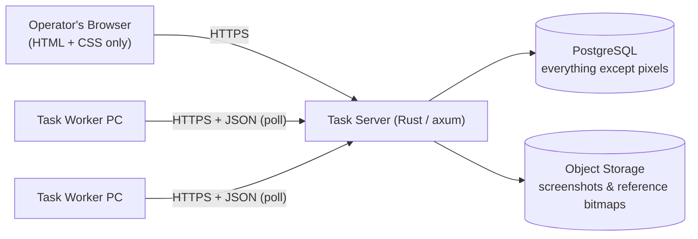
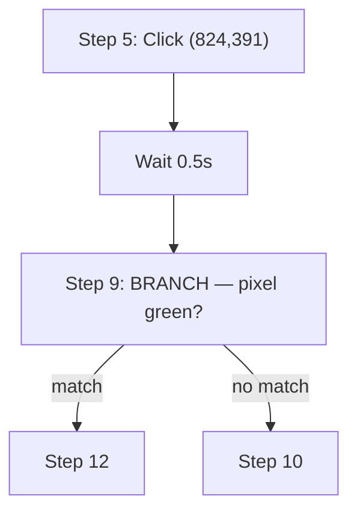

# GUI Automation Task Server — Technical Specification

This document specifies the **task server** only: the Rust web application that stores automations, serves the zero-JavaScript operator interface, and exposes the JSON API that headless task-worker PCs use to register and pull work. The worker-PC agent itself (the program that actually clicks, presses keys, and grabs pixels on the target machine) is a separate project and is out of scope — see [Out of Scope](#out-of-scope).

## Table of Contents

1. [Scope & Assumptions](#scope--assumptions)
2. [Architecture Overview](#architecture-overview)
3. [Technology Stack](#technology-stack)
4. [Design Principles for a Zero-JavaScript Interface](#design-principles-for-a-zero-javascript-interface)
5. [Data Model](#data-model)
6. [Worker-Facing API (HTTP/JSON)](#worker-facing-api-httpjson)
7. [Web Interface — Route Map](#web-interface--route-map)
8. [Web Interface — Pages, Layout & Controls](#web-interface--pages-layout--controls)
9. [Scheduling & Dispatch](#scheduling--dispatch)
10. [Security & Access Control](#security--access-control)
11. [Performance & Efficiency Summary](#performance--efficiency-summary)
12. [Out of Scope](#out-of-scope)

---

## Scope & Assumptions

The five basic step primitives, some interpretive decisions were needed to turn the brief into a concrete schema. These are called out here so they're easy to challenge or override:

- **"Wait" is a step attribute, not a 6th step type.** Every step carries an optional `post_delay_ms`, executed after the step's own action and before the next step starts. This matches the example log ("click xy, wait 0.5 seconds, ...") without inventing an action outside the five specified.
- **BRANCH owns its own condition; Find RGB / Find Bitmap are separate, non-branching steps.** A BRANCH step embeds a fresh pixel- or bitmap-search condition and two goto targets (match / no-match), per "a step with a search for a RGB pixel or bitmap and depending on if found or not found, the logic will branch." Standalone Find RGB / Find Bitmap steps instead write their result into a named **variable** — useful for logging, or for feeding a later step (e.g. clicking at the location a bitmap search just found, so the automation tolerates minor UI drift instead of relying on a hardcoded coordinate).
- **GOTO targets reference a step's stable ID, not its displayed number.** Displayed "Step N" numbers are computed from current ordering at render time, so inserting or deleting steps elsewhere never silently repoints a branch.
- **Recording is server-orchestrated.** The operator starts a recording from the web UI against an already-registered worker PC; the worker streams captured events back over the same JSON API used for task execution, rather than being a fully offline/manual process.
- **Scale target is an internal ops tool**, not an internet-scale SaaS — realistically dozens to a few hundred worker PCs on an office/warehouse network. This shapes several choices below (pull/poll over persistent connections, `SKIP LOCKED`-based dispatch instead of a message broker).

## Architecture Overview



Workers **poll**; the server never opens a connection to a worker. That's a deliberate choice, not just a REST convention — office/warehouse PCs are routinely behind NAT or restrictive firewalls, and a pull model means zero inbound-connectivity requirements on the worker side.

## Technology Stack

| Concern | Choice | Why |
| --- | --- | --- |
| Web framework | **axum** on **tokio** | Async, tower middleware ecosystem, strong throughput for a server that will hold many long-poll connections from workers open at once |
| Database access | **sqlx** (Postgres driver) | Compile-time-checked queries against the real schema, async connection pooling, no ORM indirection over queries that need to be fast (step ordering, dispatch) |
| Server-rendered HTML | **askama** (currently 0.13.x) | Compiles templates to Rust at build time — zero runtime parse cost, and template/context mismatches are compile errors. This matters more than usual here because, with no client-side JS, *every* interaction re-renders a full page server-side |
| Sessions | Row in a `sessions` table + opaque signed cookie holding only the session ID | Easy to revoke (delete the row), and keeps auth state in Postgres per the "everything in SQL tables" constraint |
| Password hashing | **argon2id** | Correct tool for low-entropy user secrets |
| Worker credential hashing | **SHA-256** (not argon2) | Worker API keys are generated as 256-bit random tokens, not human passwords — they're already high-entropy, so a slow KDF only adds CPU cost on every single worker request for no security benefit |
| Object storage | Any S3-compatible store (AWS S3 or self-hosted MinIO) via `aws-sdk-s3` | Presigned GET/PUT URLs let the browser and worker PCs talk to the bucket directly — see [Performance & Efficiency Summary](#performance--efficiency-summary) |
| Cron parsing | **croner** | Accurate next-run computation, timezone-aware, and — critically — configurable to accept standard 5-field cron rather than the 6- or 7-field variants used by `tokio-cron-scheduler` / the `cron` crate, which is what an operator typing "cron-like syntax" will expect |
| Scheduling loop | Hand-rolled `tokio::time::interval` background task against the server's own `schedules`/`task_runs` tables (see [Scheduling & Dispatch](#scheduling--dispatch)) | `tokio-cron-scheduler` is the more featureful option and is worth knowing about, but its built-in job persistence would become a second source of truth alongside the `schedules` table the UI manages — for this constraint set, `croner` for math plus a thin dispatch loop is the cleaner fit |
| Image metadata | `image` crate, dimension probing only | No server-side rendering pipeline is needed for the multi-zoom screenshot views — see below |
| Migrations | `sqlx::migrate!` | Versioned, checked into the repo alongside the code that depends on the schema |
| Observability | `tracing` + `tracing-subscriber`, structured JSON logs | Standard for axum/tokio services |

This is the same foundation as MailPi (axum, askama, sqlx, Argon2, zero-JS) — the harder, genuinely new problems in this spec are the multi-worker orchestration, branching execution logic, and the screenshot/zoom UI, which is where the detail below is concentrated.

## Design Principles for a Zero-JavaScript Interface

Three UX requirements in the brief — three zoom levels per screenshot, a way to *pick* a pixel coordinate by looking at the screen, and "live-ish" progress pages — would normally reach for JS. Pure HTML/CSS solutions exist for all three; here's how they work.

### 1. Three zoom levels from one stored image, via CSS, no server-side rendering

Rather than pre-rendering three raster variants of every screenshot (real CPU and storage cost, multiplied by every step in every automation), each zoom level is a fixed-size `<div>` using the *same* image as a CSS `background-image`, with `background-size` and `background-position` doing the magnification and panning. This is the classic "CSS magnifier" technique, and it composes cleanly with a grey pixel grid as a second, layered background:

```html
<div class="shot shot--grid" style="
    background-image:
      repeating-linear-gradient(to right, transparent 0 19px, rgba(128,128,128,.6) 19px 20px),
      repeating-linear-gradient(to bottom, transparent 0 19px, rgba(128,128,128,.6) 19px 20px),
      url('{{ presigned_url }}');
    background-size: 20px 20px, 20px 20px, {{ native_w * 20 }}px {{ native_h * 20 }}px;
    background-position: 0 0, 0 0, {{ pan_x }}px {{ pan_y }}px;
  ">
  <span class="marker" style="left: {{ marker_left_px }}px; top: {{ marker_top_px }}px;"></span>
</div>
```

```css
.shot { position: relative; overflow: hidden; width: 320px; height: 320px; image-rendering: pixelated; }
.marker { position: absolute; width: 0; height: 0; border: 9px solid transparent; border-top-color: #e0242c;
          transform: translate(-50%, -100%); }
```

Three viewports per step, same underlying ``/background source:

| Panel | Zoom | Typical window | What it shows |
| --- | --- | --- | --- |
| Normal | 1× (fit) | \~600×340 | Full-frame context |
| 400% | 4× | 320×320 window ≈ 80×80 native px | Tight context around the point of interest |
| Pixel grid | 20× | 320×320 window ≈ 16×16 native px | Individual pixels, 1px grey grid between them, for exact color verification |

`pan_x`/`pan_y` and the marker's position are computed server-side per panel (each panel has its own scale, so the same native coordinate lands at a different on-screen offset in each), and injected as inline styles by askama. `image-rendering: pixelated` keeps the zoomed pixels crisp instead of blurred by browser interpolation. Nothing here executes on the server beyond arithmetic and template substitution — the browser does all the actual scaling.

### 2. Picking a coordinate without JavaScript: `<input type="image">`

HTML has a native, pre-JS mechanism for "click on a picture, submit the coordinates": an `<input type="image">` submits the form with the clicked pixel position as `name.x` / `name.y`. Coordinate entry for mouse-click steps, pixel-check steps, and BRANCH pixel conditions uses this in two passes, reusing the exact zoom machinery from above:

1. **Coarse pick** — the full (scaled-to-fit) screenshot as an image-input. The server converts the returned coordinate by the known display scale factor to an approximate native pixel.
2. **Fine pick** — the server re-renders a small crop around that approximate point at high zoom (the same 20×-with-grid panel used for viewing), again as an image-input. The click this time lands within one native pixel.

The resulting X/Y are pre-filled into ordinary numeric `<input>` fields on the step form, which stay editable — so a precise known coordinate can always just be typed in directly, and the picker is a convenience, not the only path.

Selecting a **region** (for a reference bitmap, used by Find Bitmap / BRANCH-bitmap steps) reuses the same primitive twice in sequence: "click the top-left corner," then "click the bottom-right corner," each a single image-input submission. The server shows the resulting crop back for confirmation (Save / Re-pick) before it's written to `bitmaps`.

### 3. Standard form mechanics

Every mutation is a plain `<form method="post">` followed by a redirect (POST/Redirect/GET), so the back button and page refresh behave correctly with no client state to lose. CSRF tokens are embedded as a hidden field per form, tied to the session. "Live" pages that would normally poll via JS (an in-progress recording, an in-progress run) instead use `<meta http-equiv="refresh" content="3">` — a full but cheap page reload every few seconds, which is a perfectly serviceable idle-conscious substitute for a websocket when the update cadence is "every couple of seconds" rather than sub-second.

File uploads (a manually-uploaded reference bitmap in the web UI) use an **S3 presigned POST policy**, which — unlike a presigned PUT — is specifically designed to be the `action` of a plain multipart HTML form: the browser uploads the file bytes directly to the bucket, and only the resulting object key is POSTed back to axum. No image bytes are ever proxied through the app server for either uploads or downloads.

## Data Model

All tables live in PostgreSQL. Grouped by concern below; a real migration would need dependency-ordered `CREATE TABLE`s (users → automations → steps → step-detail tables → runs …), omitted here for readability.

### Identity & Access

| Table | Key columns | Notes |
| --- | --- | --- |
| `users` | `id`, `username` UNIQUE, `password_hash`, `display_name`, `role` (`admin`/`editor`/`viewer`), `is_active`, `created_at`, `last_login_at` |  |
| `sessions` | `id` UUID PK, `user_id` FK, `created_at`, `expires_at` TIMESTAMPTZ, `ip_address` INET, `user_agent` | Deleting a row logs that session out immediately |
| `audit_log` | `id`, `user_id` FK NULL, `action`, `entity_type`, `entity_id`, `details` JSONB, `created_at` | Every create/update/delete from the web UI writes one row here |

### Automations & Steps

```sql
CREATE TABLE automations (
    id            BIGSERIAL PRIMARY KEY,
    name          TEXT NOT NULL,
    description   TEXT NOT NULL DEFAULT '',
    status        TEXT NOT NULL DEFAULT 'draft' CHECK (status IN ('draft','active','archived')),
    created_by    BIGINT NOT NULL REFERENCES users(id),
    created_at    TIMESTAMPTZ NOT NULL DEFAULT now(),
    updated_at    TIMESTAMPTZ NOT NULL DEFAULT now()
);

-- `position` is a sparse float, not a dense integer: inserting between step A (pos 10) and
-- step B (pos 20) just writes pos 15 — no renumbering of the rest of the automation. A
-- background compaction renumbers an automation's steps back to round gaps only if repeated
-- inserts exhaust the available precision between two neighbors.
CREATE TABLE automation_steps (
    id             BIGSERIAL PRIMARY KEY,
    automation_id  BIGINT NOT NULL REFERENCES automations(id) ON DELETE CASCADE,
    position       DOUBLE PRECISION NOT NULL,
    step_type      TEXT NOT NULL CHECK (step_type IN
                     ('mouse_click','key_press','find_pixel_rgb','find_bitmap','branch')),
    label          TEXT,                    -- optional user name, e.g. "Is Green?"
    post_delay_ms  INTEGER NOT NULL DEFAULT 0,
    created_at     TIMESTAMPTZ NOT NULL DEFAULT now(),
    updated_at     TIMESTAMPTZ NOT NULL DEFAULT now(),
    UNIQUE (automation_id, position)
);
CREATE INDEX idx_steps_automation_position ON automation_steps (automation_id, position);
```

One detail table per step type, `step_id` doubling as PK and FK (1:1 with `automation_steps`) so every type's columns are properly typed and constrained instead of living in a loose JSON blob:

```sql
CREATE TABLE step_mouse_clicks (
    step_id        BIGINT PRIMARY KEY REFERENCES automation_steps(id) ON DELETE CASCADE,
    x              INTEGER,               -- literal coordinate ...
    y              INTEGER,
    x_variable_id  BIGINT REFERENCES automation_variables(id),   -- ... or bound to a variable
    y_variable_id  BIGINT REFERENCES automation_variables(id),   --    (e.g. output of a prior
                                                                  --     Find Bitmap step)
    button         TEXT NOT NULL DEFAULT 'left' CHECK (button IN ('left','right','middle')),
    click_type     TEXT NOT NULL DEFAULT 'single' CHECK (click_type IN ('single','double')),
    CHECK ((x IS NOT NULL) <> (x_variable_id IS NOT NULL)),
    CHECK ((y IS NOT NULL) <> (y_variable_id IS NOT NULL))
);

CREATE TABLE step_key_presses (
    step_id    BIGINT PRIMARY KEY REFERENCES automation_steps(id) ON DELETE CASCADE,
    key_combo  TEXT NOT NULL          -- "+"-delimited chord, e.g. "ctrl+alt+delete", "F5"
);

CREATE TABLE step_find_pixel_rgb (
    step_id             BIGINT PRIMARY KEY REFERENCES automation_steps(id) ON DELETE CASCADE,
    x                   INTEGER NOT NULL,
    y                   INTEGER NOT NULL,
    output_variable_id  BIGINT REFERENCES automation_variables(id)
);

CREATE TABLE step_find_bitmap (
    step_id                   BIGINT PRIMARY KEY REFERENCES automation_steps(id) ON DELETE CASCADE,
    reference_bitmap_id       BIGINT NOT NULL REFERENCES bitmaps(id),
    search_x                  INTEGER,     -- NULL region = whole screen
    search_y                  INTEGER,
    search_width              INTEGER,
    search_height             INTEGER,
    match_threshold           REAL NOT NULL DEFAULT 0.95,
    output_found_variable_id  BIGINT REFERENCES automation_variables(id),
    output_x_variable_id      BIGINT REFERENCES automation_variables(id),
    output_y_variable_id      BIGINT REFERENCES automation_variables(id)
);

-- BRANCH embeds its own condition (either flavor) plus the two goto targets. Targets are FKs
-- to the step's stable id, so reordering/inserting elsewhere in the automation never repoints
-- a branch — the "Step N" number shown to the user is computed from `position` at render time.
CREATE TABLE step_branches (
    step_id              BIGINT PRIMARY KEY REFERENCES automation_steps(id) ON DELETE CASCADE,
    condition_type       TEXT NOT NULL CHECK (condition_type IN ('pixel_rgb','bitmap')),
    x                    INTEGER,  y INTEGER,
    expected_r           SMALLINT, expected_g SMALLINT, expected_b SMALLINT, tolerance SMALLINT,
    reference_bitmap_id  BIGINT REFERENCES bitmaps(id),
    search_x INTEGER, search_y INTEGER, search_width INTEGER, search_height INTEGER,
    match_threshold      REAL,
    on_match_step_id     BIGINT REFERENCES automation_steps(id),
    on_no_match_step_id  BIGINT REFERENCES automation_steps(id),
    CHECK (
      (condition_type = 'pixel_rgb' AND x IS NOT NULL AND reference_bitmap_id IS NULL) OR
      (condition_type = 'bitmap' AND reference_bitmap_id IS NOT NULL AND x IS NULL)
    )
);
```

**Dynamic value binding.** The `*_variable_id` columns above generalize: any numeric/color field that plausibly needs to vary at runtime (a coordinate, an expected color, a tolerance) can be bound to a declared variable instead of a literal, using the same "exactly one of literal-or-reference" CHECK pattern shown for `step_mouse_clicks`. The step-edit form surfaces this as a small toggle next to the relevant field ("fixed value" / "from variable ▾") rather than duplicating the whole form per binding mode.

### Screenshots, Bitmaps, Variables, Parameters

```sql
CREATE TABLE bitmaps (              -- reference images used for on-screen matching
    id                   BIGSERIAL PRIMARY KEY,
    automation_id        BIGINT REFERENCES automations(id) ON DELETE CASCADE,  -- NULL = shared library
    name                 TEXT NOT NULL,
    object_storage_key   TEXT NOT NULL,
    width INTEGER NOT NULL, height INTEGER NOT NULL,
    created_by           BIGINT NOT NULL REFERENCES users(id),
    created_at           TIMESTAMPTZ NOT NULL DEFAULT now()
);

CREATE TABLE step_screenshots (     -- one editor-display screenshot per step
    step_id              BIGINT PRIMARY KEY REFERENCES automation_steps(id) ON DELETE CASCADE,
    object_storage_key   TEXT NOT NULL,
    width INTEGER NOT NULL, height INTEGER NOT NULL,
    captured_at          TIMESTAMPTZ NOT NULL DEFAULT now()
);

CREATE TABLE automation_variables ( -- runtime-populated, declared per automation
    id             BIGSERIAL PRIMARY KEY,
    automation_id  BIGINT NOT NULL REFERENCES automations(id) ON DELETE CASCADE,
    name           TEXT NOT NULL,
    var_type       TEXT NOT NULL CHECK (var_type IN ('int','bool','color','point','string')),
    description    TEXT NOT NULL DEFAULT '',
    UNIQUE (automation_id, name)
);

CREATE TABLE automation_parameters ( -- user-adjustable constants (tolerances, thresholds, ...)
    id             BIGSERIAL PRIMARY KEY,
    automation_id  BIGINT NOT NULL REFERENCES automations(id) ON DELETE CASCADE,
    name           TEXT NOT NULL,
    param_type     TEXT NOT NULL CHECK (param_type IN ('int','bool','color','string')),
    default_value  TEXT NOT NULL,
    description    TEXT NOT NULL DEFAULT '',
    UNIQUE (automation_id, name)
);
```

### Workers & Scheduling

```sql
CREATE TABLE task_worker_pcs (
    id                   BIGSERIAL PRIMARY KEY,
    hostname             TEXT NOT NULL,
    display_name         TEXT NOT NULL,
    api_key_hash         BYTEA NOT NULL,           -- SHA-256 of the worker's bearer token
    registration_token   TEXT UNIQUE,               -- one-time; cleared after first /register call
    status               TEXT NOT NULL DEFAULT 'offline'
                            CHECK (status IN ('offline','online','busy','error')),
    last_heartbeat_at    TIMESTAMPTZ,
    screen_width         INTEGER, screen_height INTEGER,
    os_info              TEXT, agent_version TEXT,
    created_at           TIMESTAMPTZ NOT NULL DEFAULT now()
);

CREATE TABLE worker_groups ( id BIGSERIAL PRIMARY KEY, name TEXT NOT NULL UNIQUE, description TEXT NOT NULL DEFAULT '' );
CREATE TABLE worker_group_members (
    worker_id  BIGINT NOT NULL REFERENCES task_worker_pcs(id) ON DELETE CASCADE,
    group_id   BIGINT NOT NULL REFERENCES worker_groups(id) ON DELETE CASCADE,
    PRIMARY KEY (worker_id, group_id)
);

CREATE TABLE schedules (
    id                BIGSERIAL PRIMARY KEY,
    automation_id     BIGINT NOT NULL REFERENCES automations(id) ON DELETE CASCADE,
    name              TEXT NOT NULL,
    cron_expression   TEXT NOT NULL,          -- standard 5-field; validated with `croner` on save
    timezone          TEXT NOT NULL DEFAULT 'UTC',
    worker_group_id   BIGINT REFERENCES worker_groups(id),  -- NULL = any available worker
    is_enabled        BOOLEAN NOT NULL DEFAULT true,
    next_run_at       TIMESTAMPTZ,
    last_run_at       TIMESTAMPTZ,
    created_by        BIGINT NOT NULL REFERENCES users(id),
    created_at        TIMESTAMPTZ NOT NULL DEFAULT now()
);
CREATE INDEX idx_schedules_due ON schedules (next_run_at) WHERE is_enabled;
```

### Runs & Recording

```sql
CREATE TABLE task_runs (
    id                    BIGSERIAL PRIMARY KEY,
    automation_id         BIGINT NOT NULL REFERENCES automations(id),
    schedule_id           BIGINT REFERENCES schedules(id),      -- NULL = manually triggered
    worker_id             BIGINT REFERENCES task_worker_pcs(id),
    status                TEXT NOT NULL DEFAULT 'queued'
                            CHECK (status IN ('queued','running','succeeded','failed','cancelled','lost')),
    triggered_by_user_id  BIGINT REFERENCES users(id),
    current_step_id       BIGINT REFERENCES automation_steps(id),
    queued_at             TIMESTAMPTZ NOT NULL DEFAULT now(),
    started_at            TIMESTAMPTZ, completed_at TIMESTAMPTZ,
    error_message         TEXT
);
CREATE INDEX idx_task_runs_queued ON task_runs (status, queued_at) WHERE status = 'queued';

CREATE TABLE task_run_steps (       -- per-step execution log, for the run-detail page
    id              BIGSERIAL PRIMARY KEY,
    task_run_id     BIGINT NOT NULL REFERENCES task_runs(id) ON DELETE CASCADE,
    step_id         BIGINT NOT NULL REFERENCES automation_steps(id),
    started_at      TIMESTAMPTZ NOT NULL DEFAULT now(), completed_at TIMESTAMPTZ,
    result          TEXT CHECK (result IN ('success','failed','branch_matched','branch_not_matched')),
    captured_r SMALLINT, captured_g SMALLINT, captured_b SMALLINT,
    captured_found  BOOLEAN, captured_x INTEGER, captured_y INTEGER,
    screenshot_object_key  TEXT
);

CREATE TABLE task_run_variable_values (
    task_run_id     BIGINT NOT NULL REFERENCES task_runs(id) ON DELETE CASCADE,
    variable_id     BIGINT NOT NULL REFERENCES automation_variables(id),
    value           TEXT NOT NULL,     -- point/color serialized as small JSON, e.g. {"x":10,"y":20}
    set_at_step_id  BIGINT REFERENCES automation_steps(id),
    set_at          TIMESTAMPTZ NOT NULL DEFAULT now(),
    PRIMARY KEY (task_run_id, variable_id)
);

CREATE TABLE recording_sessions (
    id                        BIGSERIAL PRIMARY KEY,
    worker_id                 BIGINT NOT NULL REFERENCES task_worker_pcs(id),
    started_by_user_id        BIGINT NOT NULL REFERENCES users(id),
    status                    TEXT NOT NULL DEFAULT 'recording'
                                CHECK (status IN ('recording','completed','imported','discarded')),
    resulting_automation_id   BIGINT REFERENCES automations(id),
    started_at                TIMESTAMPTZ NOT NULL DEFAULT now(), ended_at TIMESTAMPTZ
);

CREATE TABLE recording_events (
    id                     BIGSERIAL PRIMARY KEY,
    recording_session_id   BIGINT NOT NULL REFERENCES recording_sessions(id) ON DELETE CASCADE,
    sequence_number         INTEGER NOT NULL,
    event_type             TEXT NOT NULL CHECK (event_type IN ('mouse_click','key_press','screenshot')),
    x INTEGER, y INTEGER, button TEXT, key_combo TEXT,
    screenshot_object_key   TEXT,
    captured_at             TIMESTAMPTZ NOT NULL,
    UNIQUE (recording_session_id, sequence_number)
);
```

`task_runs.status` includes `'lost'` distinct from `'failed'`: a run whose worker stops heartbeating mid-execution is a different situation (crashed agent, network drop, unplugged PC) from one that ran to completion and reported a genuine failure, and conflating them into one bare "failed" bucket loses exactly the information you'd want when debugging why a run didn't finish. The dispatch loop (below) is what detects and sets this state.

## Worker-Facing API (HTTP/JSON)

All endpoints below are `/api/v1/workers/...`. Every request except `/register` carries `Authorization: Bearer <api_key>`, checked against `task_worker_pcs.api_key_hash`. Communication is entirely worker-initiated (poll → response), including "stop this recording" and "cancel this run," which piggyback on the worker's next scheduled call rather than requiring the server to reach out.

| Method & Path | Purpose |
| --- | --- |
| `POST /register` | Exchange a one-time registration token (created by an admin on the [Workers page](#worker-pcs)) for a permanent API key. Token is cleared on first successful use. |
| `POST /heartbeat` | Periodic liveness + status ping. Body: `{status, current_task_run_id?}`. |
| `GET /next-assignment` | Long-poll (\~25s) for work. Returns one of `{"type":"none"}`, `{"type":"execute_automation", task_run_id, automation:{...steps...}}`, or `{"type":"start_recording", recording_session_id}`. |
| `GET /task-runs/{run_id}` | Re-fetch the full automation definition (resume after an agent crash/restart). |
| `POST /task-runs/{run_id}/step-result` | Report one executed step's outcome: `{step_id, result, captured_rgb?, captured_found?, captured_xy?, timestamp}`. |
| `GET /task-runs/{run_id}/screenshot-upload-url` | Returns a short-lived presigned S3 `PUT` URL + object key for an execution-time screenshot. |
| `POST /task-runs/{run_id}/screenshots/{object_key}/commit` | Registers an uploaded screenshot's metadata (width/height) against a `task_run_steps` row after the direct S3 PUT completes. |
| `POST /task-runs/{run_id}/complete` | `{status: succeeded\|failed, error_message?}`. |
| `POST /recordings/{session_id}/events` | Push a **batch** of captured input events (not one call per click — see [Performance Summary](#performance--efficiency-summary)). |
| `GET /recordings/{session_id}/screenshot-upload-url` | Presigned `PUT` URL for a recording-time screenshot. |
| `POST /recordings/{session_id}/stop` | Worker-initiated end of recording (e.g. operator's stop hotkey). |

Every response to `/heartbeat` and `/recordings/{id}/events` includes a `{"cancel_requested": bool}` / `{"stop_requested": bool}` flag respectively — the mechanism by which an operator's "Cancel" or "Stop Recording" click in the browser actually reaches the worker, without the server ever initiating a connection.

Example `next-assignment` response for an automation run:

```json
{
  "type": "execute_automation",
  "task_run_id": 4821,
  "automation": {
    "id": 12,
    "parameters": { "click_tolerance": 8 },
    "steps": [
      { "id": 501, "type": "mouse_click", "x": 824, "y": 391, "button": "left",
        "click_type": "single", "post_delay_ms": 500 },
      { "id": 502, "type": "branch", "condition": { "type": "pixel_rgb", "x": 824, "y": 391,
        "expected_rgb": [40, 180, 60], "tolerance": 10 },
        "on_match_step_id": 509, "on_no_match_step_id": 503 }
    ]
  }
}
```

## Web Interface — Route Map

All GET routes render an askama template; all POST routes mutate then redirect (303) to a GET route. Routes are grouped by area; role requirements are shorthand (`E+` = editor or admin, `A` = admin only, blank = any authenticated role including viewer).

| Area | Method & Path | Role | Purpose |
| --- | --- | --- | --- |
| Auth | `GET/POST /login`, `POST /logout` | — | Session start/end |
| Dashboard | `GET /` |  | Landing overview |
| Automations | `GET /automations` |  | List + filter |
|  | `GET /automations/new` , `POST /automations` | E+ | Create blank automation |
|  | `GET /automations/{id}` |  | Step-by-step editor (the centerpiece — see below) |
|  | `POST /automations/{id}` | E+ | Rename / edit description / status |
|  | `GET/POST /automations/{id}/delete` | E+ | Archive/delete with confirmation |
|  | `POST /automations/{id}/run-now` | E+ | Trigger an immediate run |
| Steps | `GET /automations/{id}/steps/new` | E+ | Type picker (5 buttons) |
|  | `GET /automations/{id}/steps/new/{type}` , `POST /automations/{id}/steps` | E+ | Type-specific create form (incl. coordinate/region picker) |
|  | `GET /automations/{id}/steps/{sid}/edit` , `POST /automations/{id}/steps/{sid}` | E+ | Edit existing step |
|  | `POST /automations/{id}/steps/{sid}/delete` | E+ | Delete (confirm) |
|  | `POST /automations/{id}/steps/{sid}/move-up` \| `/move-down` | E+ | Reorder by one position |
| Variables/Params | `GET /automations/{id}/variables` , `POST .../variables` , `POST .../variables/{vid}` , `POST .../variables/{vid}/delete` | E+ | Declare/edit/remove |
|  | same pattern under `/parameters` | E+ | Adjustable constants |
| Bitmaps | `GET /automations/{id}/bitmaps` , `POST .../bitmaps` (S3 presigned-POST form) , `POST .../bitmaps/{bid}/delete` | E+ | Reference-image library |
| Recording | `GET /workers/{id}/record` , `POST /workers/{id}/record/start` | E+ | Choose worker, start session |
|  | `GET /recordings/{id}` |  | Live-ish status (`meta refresh`) |
|  | `GET /recordings/{id}/review` | E+ | Step-by-step review of captured events |
|  | `POST /recordings/{id}/convert` , `POST /recordings/{id}/discard` , `POST /recordings/{id}/stop` | E+ | Finalize |
| Schedules | `GET /schedules` , `GET /schedules/new` , `POST /schedules` | E+ | List / create |
|  | `GET /schedules/{id}/edit` , `POST /schedules/{id}` , `POST /schedules/{id}/delete` , `POST /schedules/{id}/toggle` | E+ | Edit / remove / enable-disable |
| Runs | `GET /runs` |  | History, filterable by automation/worker/status |
|  | `GET /runs/{id}` |  | Step-by-step execution log |
|  | `POST /runs/{id}/cancel` | E+ | Request cancellation |
| Workers | `GET /workers` , `GET /workers/new` , `POST /workers` | A | List / register (issues token) |
|  | `GET /workers/{id}` , `POST /workers/{id}/deactivate` , `POST /workers/{id}/rotate-key` | A | Detail / manage |
| Users | `GET /users` , `.../new` , `.../{id}/edit` , `.../{id}/delete` | A | User management |
|  | `GET /account` , `POST /account/password` |  | Self-service |
| Media | `GET /media/screenshots/{id}` , `GET /media/bitmaps/{id}` |  | 302-redirects to a short-lived presigned S3 GET URL (see [Performance](#performance--efficiency-summary)) |

## Web Interface — Pages, Layout & Controls

**Global chrome.** Top nav bar: *Dashboard · Automations · Schedules · Runs · Workers · Users (admin only) · \[display name\] ▾ (Account / Log out)*. Inside an automation, a left sub-nav adds: *Steps · Variables · Parameters · Bitmaps · Schedules · Run History*, all scoped to that automation.

### Dashboard

Four summary tiles (active automations, workers online, runs today, failed/lost runs today), a "Recent Runs" table (last 10, linked), a "Workers" status table. Buttons: **New Automation**, **New Schedule**.

### Automations List

Table: Name · Status badge · Step count · Last modified · Last run (status + time, linked) · Actions. A GET-based filter bar (status, text search) reloads the page with query params — no JS needed for filtering. Top-right: **+ New Automation**, which offers **From Scratch** or **From a Recording** (→ worker picker).

### Automation Editor — the centerpiece

Header: name (inline-editable), status badge, description. Action bar: **Run Now**, **+ New Step**, **Record New Steps**, plus the sub-nav to Variables/Parameters/Bitmaps/Schedules/History.

Steps are shown as a vertically stacked list of step cards (not a dense spreadsheet grid — each card carries three sizeable images, so a tight table wouldn't fit them). Long automations paginate (20 steps/page) rather than trying to lazy-load without JS. Each card:

- **Step number + type** and a **plain-language line**, generated per the templates below (never shows raw config/code):

  | Step type | Rendered as |
  | --- | --- |
  | mouse_click | "Step 5 — Click (824, 391) \[left, single\]" |
  | key_press | "Step 6 — Press ctrl+alt+delete" |
  | find_pixel_rgb | "Step 7 — Read pixel at (100, 200) → store as «bg_color»" |
  | find_bitmap | "Step 8 — Search for «login_button» on screen → store as «found_login»" |
  | branch | "Step 9 — BRANCH: if pixel at (824, 391) ≈ RGB(40,180,60) ±10 → go to Step 12, else → go to Step 10" |

  — plus "· then wait 0.5s" appended when `post_delay_ms > 0`. A step's `label`, when set, is used in place of the auto-generated phrase (e.g. "Step 9 — **Is Green?**: ...").
- **Three screenshot panels** (Normal / 400% / Pixel Grid) per [Design Principles §1](#1-three-zoom-levels-from-one-stored-image-via-css-no-server-side-rendering), with the red triangle marking the relevant coordinate (click target, pixel-check point, or region corner).
- **Controls row**: `Edit` · `Insert Above` · `Insert Below` · `Move Up` · `Move Down` · `Delete` — each a small same-page form/button; Move Up/Down swap `position` with the adjacent step (see [Performance Summary](#performance--efficiency-summary) for why this doesn't require renumbering).

Example execution flow, matching the card above:



**New/Edit Step.** `+ New Step` first shows five buttons (one per type) rather than one form with dynamically shown/hidden fields — a direct consequence of having no JS to toggle visibility, and arguably clearer UX regardless. Each type's form shows only its own fields, using the coordinate/region picker from [Design Principles §2](#2-picking-a-coordinate-without-javascript-input-typeimage) wherever a point or box is needed, always paired with editable numeric fallback fields. `find_bitmap` and `branch`(bitmap) forms include a **Pick Region** control (two-click box selection) plus a **Use Existing Bitmap** dropdown as an alternative to selecting fresh. A **Wait after this step** field (seconds, converted to `post_delay_ms`) appears on every type's form.

### Recording Flow

`Record New Steps` → pick an **online** worker → confirm → server creates `recording_sessions` and the worker picks it up on its next poll. The **Recording Status** page (`meta refresh`, \~3s) shows event count captured so far and a **Stop Recording** button (sets the stop-requested flag the worker checks on its next batch push). Once stopped, **Review Recording** shows each captured event exactly like a step card (screenshot, three zooms, marker) with a per-event **Exclude** checkbox, then **Convert to Automation** (bulk-creates `automations` + `automation_steps` + `step_screenshots`, redirecting into the ordinary editor for further tweaking) or **Discard**.

### Variables, Parameters, Bitmaps

Straightforward CRUD tables (Name · Type · Description/Default · Actions) with inline add-rows. The Bitmaps page additionally shows a thumbnail per entry and an **Upload New** file-picker form (posts directly to object storage via presigned POST, per [Design Principles §3](#3-standard-form-mechanics)).

### Schedules

List: Automation · Cron expression · Timezone · Worker group (or "Any available") · Next run · Enabled toggle · Actions. Create/Edit form: automation picker, cron expression text field with an inline example hint ("`0 9 * * MON-FRI` = weekdays at 9am"; 5-field, validated server-side with `croner` on submit — a malformed expression re-renders the form with the field's error inline, still no JS required), timezone select, worker-group select (default: any available), **Enabled** checkbox.

### Run History

List, filterable (automation, worker, status, date range) via GET query params. **Run Detail**: header (automation, worker, triggered-by, timing, status incl. `lost`), then a step-by-step log in the same card style as the editor but showing *actual captured* values (the real RGB read, the real match location) rather than the step's configured expectation, plus a **Cancel Run** button when still in progress (meta-refreshing page while running).

### Workers

List: Hostname/Display name · Status · Last heartbeat · Current run (linked) · Actions. **Register New** issues a one-time token to configure into the worker agent. Worker detail page: recent runs on this PC, **Rotate API Key**, **Deactivate**, **Record New Steps** shortcut.

### Users (admin) & Account

Ordinary user CRUD (username, display name, role) for Users; a self-service password-change form under Account for everyone.

## Scheduling & Dispatch

A single background tokio task ticks every \~30s:

1. `SELECT * FROM schedules WHERE is_enabled AND next_run_at <= now() FOR UPDATE SKIP LOCKED` — the `SKIP LOCKED` clause is what makes this safe to run from more than one task-server instance at once (each due schedule is claimed by exactly one instance) without needing a separate distributed-lock system.
2. For each claimed schedule: insert a `task_runs` row (`status = 'queued'`, `schedule_id` set), then recompute and write `next_run_at` via `croner`.
3. Separately, `GET /next-assignment` calls from workers look for the oldest `queued` run whose automation's schedule (if any) allows that worker — matching `worker_group_id`, or any worker if the schedule didn't specify one — and atomically claim it (`status → 'running'`, `worker_id` set, `started_at` set), again via `FOR UPDATE SKIP LOCKED` so two workers polling simultaneously can't claim the same run.
4. The same tick also sweeps `task_runs` where `status = 'running'` and the assigned worker's `last_heartbeat_at` is older than a stale threshold (a few missed heartbeats), moving them to `status = 'lost'` — otherwise a crashed or unplugged worker leaves a run stuck "running" forever with no signal that anything went wrong.

Manual **Run Now** simply inserts a `task_runs` row directly with `schedule_id = NULL`, entering the same queue at step 3.

## Security & Access Control

| Role | Can view | Can edit automations/steps/schedules | Can manage workers | Can manage users |
| --- | --- | --- | --- | --- |
| `viewer` | everything | no | no | no |
| `editor` | everything | yes | no | no |
| `admin` | everything | yes | yes | yes |

- **Sessions**: opaque cookie (HttpOnly, Secure, SameSite=Lax) referencing a `sessions` row; server-side revocation by row deletion.
- **CSRF**: hidden token per rendered form, tied to the session, checked on every POST.
- **Login rate limiting**: attempts throttled by client IP + username with eviction, to blunt credential-stuffing against the operator login without needing a captcha (which would need JS).
- **Worker auth**: bearer API key, SHA-256-hashed at rest; `rotate-key` invalidates the old key immediately.
- **Upload safety**: image decode is bounded (max dimensions/file size enforced before decode, not after) on every path that touches `image` — both the lightweight dimension-probe on upload and, incidentally, on any future feature that does decode further — to avoid a crafted image file being used as a decompression-bomb resource-exhaustion vector.
- **Object storage**: bucket is not public; all access is via short-TTL presigned URLs minted per-request by the authenticated server, scoped to a single object.

## Performance & Efficiency Summary

| Decision | Benefit |
| --- | --- |
| Sparse `DOUBLE PRECISION` step ordering | Insert/reorder is a single-row `UPDATE`, never a renumber of the whole automation |
| CSS-only multi-zoom screenshots | Zero server-side image rendering per view; one stored image serves all three panels |
| Presigned S3 GET for `/media/*` | Image bytes flow browser ↔ bucket directly; axum never proxies binary payloads |
| Presigned S3 PUT (worker) / POST policy (browser upload) | Same for uploads, in both directions |
| Long-poll `/next-assignment` | Workers get near-real-time dispatch without websockets or short-interval polling storms |
| Batched recording-event pushes | One HTTP call per burst of input events, not one per click/keystroke |
| `SELECT ... FOR UPDATE SKIP LOCKED` for both schedule-claiming and run-claiming | Multiple task-server instances (or multiple simultaneous worker polls) can't double-dispatch the same work, with no external lock service |
| askama compiled templates | No runtime template parsing on any request — meaningful here because every interaction is a full server render |
| SHA-256 (not argon2) for worker API keys | Verifying a high-entropy machine credential on every single request doesn't pay a slow-KDF tax |
| Typed per-step-type tables over a JSON blob | Postgres enforces shape/constraints; queries and indexes work directly against real columns |
| Indexed `next_run_at` / queued-run lookups | Scheduler tick and dispatch poll are index scans, not table scans, as data grows |

## Out of Scope

- The task-worker PC agent itself (screen capture, actual mouse/keyboard injection, bitmap matching implementation) — a separate project, consuming the API in this document.
- Automation versioning/rollback beyond the `audit_log` trail.
- Multi-tenancy (this spec assumes one organization's worker fleet).
- Loop constructs beyond BRANCH's binary match/no-match (arbitrary GOTOs to earlier steps are possible at the data-model level via the same stable-ID FK mechanism, but the UI described here doesn't build authoring tools for them).
